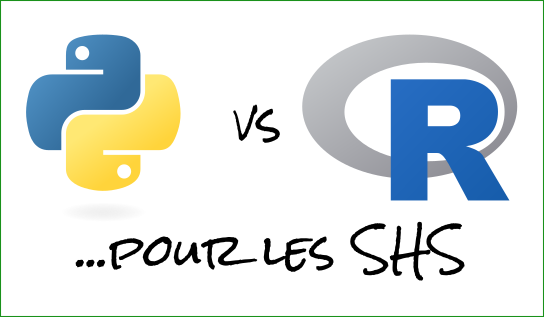

# Analyse comparative Python / R pour les SHS

_**Présentation du 16 mai 2023 / Campus Condorcet (Aubervilliers)**_

## Résumé :page_with_curl:

> Cette présentation discute des spécificités des langages R et Python, notamment au travers d'une comparaison de l'écosystème des bibliothèques disponibles pour les SHS (traitement de données géospatiales, statistiques, apprentissage, traitement automatisé de la langue, etc.) et des solutions offertes pour valoriser ces traitements (programmation lettrée, diffusion sur le Web, etc.).  
Au cours de cette présentation, un même jeu de données sera analysé à l'aide des deux langages afin d'offrir aux participants un aperçu de la syntaxe et des manières de faire dans les deux langages.

## Programme :hammer::wrench:

- Introduction - pourquoi comparer R et Python ?
- Présentation historique des deux langages
- Présentation comparée des écosystèmes (distribution, IDE, *package manager*, etc.)
- Explorer un jeu de données en R et en Python (comparaison de l'approche générale, différences de syntaxe et de philosophie entre les langages, etc.)
- Aperçu de l'écosystème de bibliothèques pour : le géospatial, les traitements statistiques, le traitement du langage, l'apprentissage et la visualisation de données
- Programmation lettrée et *notebooks*
- Combiner l'utilisation de Python et de R dans un même programme
- Conclusion : quel outil pour quelle tâche / se faire plaisir en programmant
- Discussion (env. 30 minutes)

## Support :open_file_folder:

↪ [Voir le support en ligne](https://mthh.github.io/presentation-python-r-shs/).

## Licence :copyright:

 La présentation est mise à disposition selon les termes de la <a rel="license" href="http://creativecommons.org/licenses/by-sa/2.0/fr/">Licence Creative Commons Attribution - Partage dans les Mêmes Conditions 2.0 France</a>.
